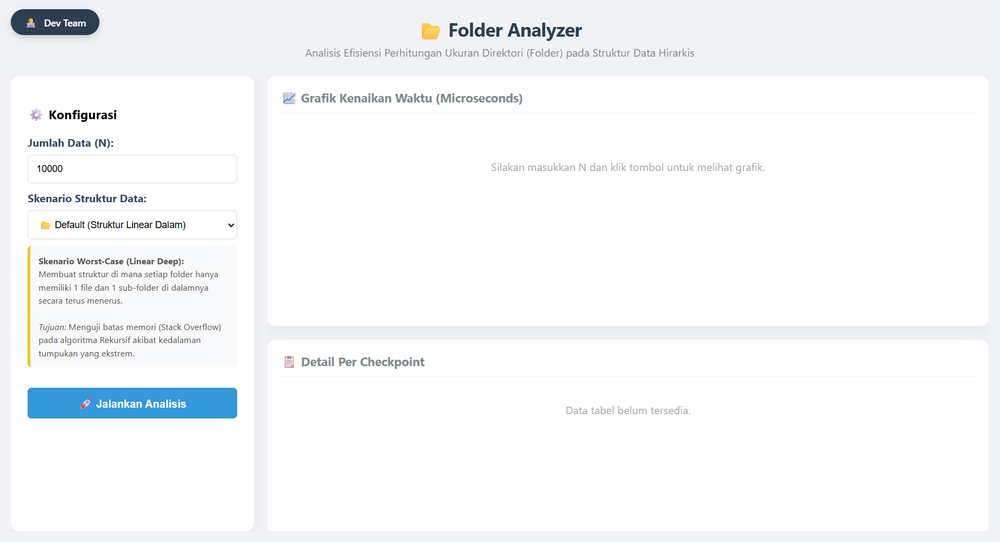
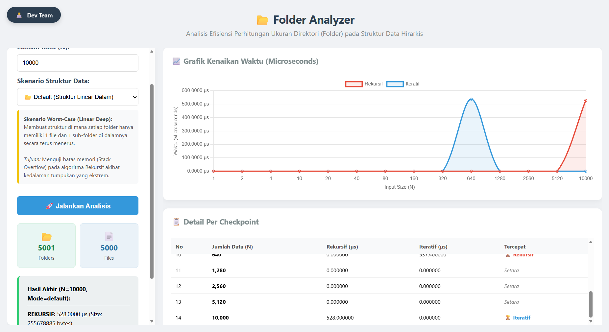

# 📂 Folder Analyzer: Algorithm Complexity Analysis
Analisis Efisiensi Perhitungan Ukuran Direktori (Folder) pada Struktur Data Hirarkis 


## 📖 Deskripsi Project

**Folder Size Analyzer** adalah program Web Base berbasis Golang yang dirancang untuk mensimulasikan dan menganalisis kinerja dua pendekatan algoritma dalam penelusuran struktur data Tree (Sistem File):
1.  **Pendekatan Rekursif:** Menggunakan fungsi yang memanggil dirinya sendiri (standar DFS).
2.  **Pendekatan Iteratif:** Menggunakan manajemen *Stack* manual.

Aplikasi ini membangkitkan data dummy dengan dua mode skenario yaitu 
1.  **Skenario Default (Worst-Case / Linear Deep Structure):**
    Mode ini dirancang untuk menciptakan kondisi ekstrem guna menguji ketahanan memori (memory safety) dari algoritma.
    - Konsep Pembentukan: Program melakukan looping sebanyak N kali. Pada setiap iterasi, program membuat satu folder baru di dalam folder sebelumnya, lalu mengisi folder tersebut dengan satu file. Pointer kemudian berpindah masuk ke folder baru tersebut.
    - Struktur Data:Menghasilkan pohon yang tumbuh vertikal (lurus ke bawah) menyerupai Garis Lurus atau Linked List panjang.
        - Kedalaman Pohon (Tree Depth) = **N**
        - Setiap Parent hanya memiliki tepat 2 anak (1 File & 1 Sub-folder).

2.  **Skenario Default (Worst-Case / Linear Deep Structure):**
     Mode ini dirancang untuk mensimulasikan kondisi nyata sistem file (Real-world File System) pada komputer pengguna.
     - Konsep Pembentukan: Program menggunakan probabilitas acak dalam pembentukan node:
         1. Pemilihan Parent: Induk folder dipilih secara acak dari daftar folder yang sudah ada (tidak selalu folder terakhir).
         2. Tipe Node: Terdapat peluang 70% node baru adalah File, dan 30% adalah Folder.
     - Struktur Data: Menghasilkan pohon yang menyebar (lebar dan dalam secara acak).
         - Satu folder bisa memiliki banyak file (gemuk) atau banyak sub-folder (bercabang).
         - Kedalaman pohon (Depth) jauh lebih kecil daripada **N**

## 📸 Screenshots
1. Dashboard Preview 1

2. Dashboard Preview 2

3. Dashboard Preview (Default Mode)

4. Dashboard Preview (Random Mode)


---

## ✨ Fitur Utama

* **⚡ Microsecons Precision:** Pengukuran waktu eksekusi tingkat tinggi menggunakan satuan *microseconds* (µs) untuk akurasi maksimal.
* **🌳 Multi Linked List Implementation:** Struktur folder tidak menggunakan Array/Slice dinamis, melainkan murni pointer **First Child & Next Sibling**.
* **📊 Real-time Visualization:** Grafik interaktif menggunakan **Chart.js** untuk membandingkan performa *Time Complexity* secara visual.
* **🧪 Dual Scenario Testing:**
    * **Random (Average Case):** Struktur pohon acak (30% Folder, 70% File) menyerupai kondisi nyata.
    * **Default (Worst Case):** Struktur linear sangat dalam (Depth = N) untuk menguji batas memori (*Stack Overflow*) pada Rekursif.
* **🏆 Winner Indicator:** Penentuan otomatis algoritma mana yang lebih cepat di setiap checkpoint data.

---

## 🛠️ Teknologi yang Digunakan

* **Backend:** Go (Golang)
* **Frontend:** HTML5, CSS3, JavaScript
* **Charting Library:** Chart.js
* **Architecture:** Monolith (Go Templates)

---

## 🧠 Analisis Algoritma

Aplikasi ini membandingkan dua pendekatan traversal pohon:

### 1. Rekursif (Recursive)
Menggunakan mekanisme pemanggilan fungsi diri sendiri.
* **Kelebihan:** Kode lebih ringkas dan mudah dibaca.
* **Kelemahan:** Memakan memori *Call Stack*. Pada struktur folder yang sangat dalam (Deep Tree), berisiko mengalami **Stack Overflow** dan overhead waktu yang tinggi.

### 2. Iteratif (Iterative)
Menggunakan simulasi Stack manual (Slice) untuk melakukan *Depth First Search* (DFS).
* **Kelebihan:** Lebih stabil pada kedalaman ekstrem karena menggunakan *Heap Memory*.
* **Implementasi:** Menggunakan logika `Push NextSibling` lalu `Push FirstChild` untuk meniru urutan traversal pohon.

---

## 🚀 Cara Menjalankan

Pastikan kamu sudah menginstall **Go** di komputer kamu.

1.  **Clone Repository**
    ```bash
    git clone [https://github.com/LionNite/TugasBesarAKA_FolderAnalyzer.git](https://github.com/LionNite/TugasBesarAKA_FolderAnalyzer.git)
    cd FolderAnalyzer
    ```

2.  **Jalankan inisiasi go module**
    ```bash
    go mod init FolderAnalyzer
    ```
    
3.  **Jalankan Aplikasi**
    ```bash
    go run .
    ```

4.  **Buka Dashboard**
    Buka browser dan akses alamat berikut:
    ```
    http://localhost:8080
    ```

---

## 📂 Struktur Proyek
```
FolderAnalyzer/
│    ├── backend/
│    │   ├── logic.go       # Generator Data Dummy & Algoritma Hitung (Iteratif/Rekursif)
│    │   └── structs.go     # Definisi Struct Node & Multi Linked List Logic
│    ├── index.html         # Frontend Dashboard (UI & Chart.js Logic)
│    └── main.go            # Web Server Handler & Main Routine
README.md                   # Dokumentasi Proyek
    
